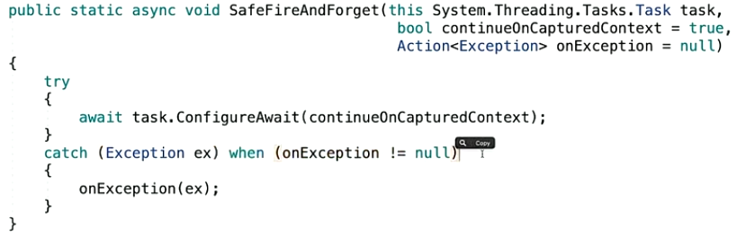

# Antipatterns

1. Если мы просто запускаем таску и не используем ```await/Wait/Result```, то все исключения, выброшенные в асинхронной операции будут потеряны. Может это действительно то, что надо и реально не стоит беспокоиться о результате. Но все же можно использовать метод расширения.



1. Не стоит использовать ```Wait()/Result```. Блокирует в итоге два потока: вызывающий(ждет) и еще один, взятый из пула для выполнения задачи.
1. Если все же нужно ждать, то вместо ```Wait()/Result``` нужно использовать ```GetAwaiter().GetResult()```, потому что вернет реальный ```Exception```(но только первый!), а не обернутый в AggregateException(зато будет все ошибки содержать).
1. Если не обязательно, чтобы после ```await```a таски работа продолжилась в исходном потоке(особенно актуально для UI потока, который может быть занят к моменту завершения задачи), а можно использовать любой другой из пула, то нужно вызвать ```ConfigureAwait(false)```. В asp.net core по умолчанию не установлен ```SynchronizationContext```, а значит при await'e нечего захватывать, поэтому не важно с каким параметром вызван ```ConfigureAwait```. (cм. [[Synchronization Context]])
1. Избегать ```return await```. Вместо этого просто вернуть результат работы второго метода. Т.о. наш метод не будет помечен как асинхронный, просто будет возвращать таску. Пусть вызывающий код уже использует ```await``` в том месте, где нужно дождаться результата выполнения. В итоге не будет создания конечного автомата и переключения контекстов. Но нельзя этого делать, если вызов второго метода обернут в ```try-catch/using``` и важно обработать ошибку. Если не ```await```'ить второй метод, то первый сразу же вернет таску, возвращенную вторым, и даже если будет ошибка, мы никогда не попадем в ```catch``` нашего метода.
1. Использовать ```ValueTask``` для "hot path", то есть ветви выполнения метода, когда он выполнятся синхронно. Это стоит делать, когда hot path выполняется 9 из 10 раз при попадании в метод. ```ValueTask``` быстрее, потому что экземпляр располагается в стэке и экономится время на работу с кучей.
1. async void методы были введены для обработки UI событий(статья) опасны потому, что мы не можем контролировать выполнение асинронной задачи. И если при появлении exception нет захваченного SynchronizationContext, чтобы в понять в какой поток передать исключение, то выбросится AppDomain.UnhandledException и завершит приложение. Если этот метод еще и публичный, и его автор забыл постфикс Async, то IntelliSence покажет нам void метод, который будешь воспринимать как синхронный, а он тем временем запускает какие-то таски. Более или менее нормальным является использование приватного async void метода, который можно вызывать из конструктора, если уж ооочень нужно запустить что-то асинхронное из конструктора. Это актуально, потому что нельзя сделать конструктор асинхронным -> нельзя использовать в нем await. Но для таких целей лучше использовать статический фабричный метод.

---

## Источники

1. link

## Ссылки

1. [Async Guidance by David Fowler](https://github.com/davidfowl/AspNetCoreDiagnosticScenarios/blob/master/AsyncGuidance.md)
