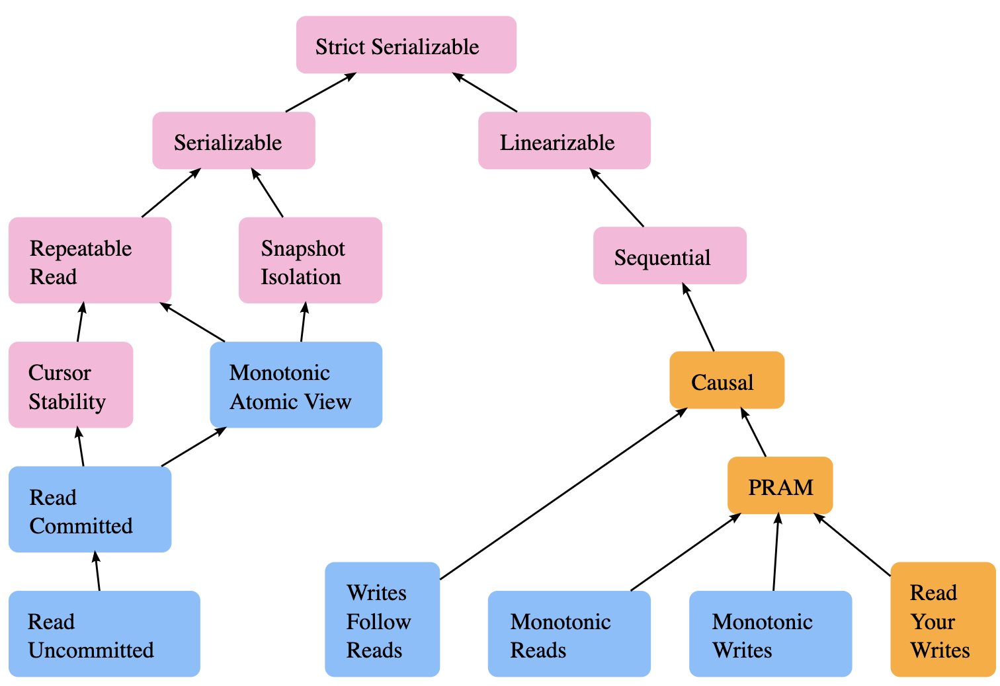

Повышение отказоустойчивости за счет добавления избыточности(репликация) приводит к тому, что появляется несколько копий данных. При этом операции(чтение и запись) могут выполняться одновременно разными процессами, поэтому эти копии нужно как-то синхронизировать. Сложность алгоритмов синхронизации вступает в противоречие с производительностью, с которой система как целое может обрабатывать запросы. Поэтому в рамках рассмотрения конкретной модели согласованности нужно принимать во внимание **Synchronization cost**.

Например на каждую операцию можно было бы брать распределенную блокировку или запускать алгоритм консенсуса(в том числе при выполнении операции чтения) добиваясь [[Atomic commitment]]. Но это явно приведет к снижению быстродействия системы. Поэтому с целью повышения производительности операции *write* и *replica update* разделяют.

В итоге имеем операции:

1. write
1. replica update
1. read

Похожий компромисс стоит и перед [[Transaction manager]] СУБД, работающей на одной машине: можно все транзакции выполнть строго последовательно, но тогда скорость работы СУБД будет низкой. В итоге ищутся варианты выполняить транзакции параллельно и при этом обеспечить [[ACID]]. И также как и при параллельном выполнении транзакций важным является порядок, в котором изменения становятся видимыми.

Это один из примеров, подтверждающий, что **распределенные системы имеют много общего с конкуррентными системами**. Но при этом когда речь идет о распределенных системах говорят о росте _performance_, но и о возможных проблемах с _availability_[Jepse site. Fundamental concepts. Systems](https://jepsen.io/consistency#systems)

Надо отметить, что синхронизация нужна только в случае изменения данных. Если данные статичны, то репликация данных дополнительных проблем не доставляет. Пример - [Content Delivery Network](https://ru.wikipedia.org/wiki/Content_Delivery_Network)

### Проблемы синхронизации

1. **операции не происходят мгновенно**, а имеют время начала и окончания
1. из п.1 следует, что операции на разных процессах могут пересекаться, т.е. быть **concurrent**
1. **отсутствие глобальных часов** - *wall clock*. Несмотря на существование [[Network Time Protocol]] добиться синхронизации с высокой точнстью очень сложно
1. **распределенные системы по своей природе асинхронны** [[Async vs sync]] - сложно делать какие-то временнЫе допущения

### История операций

Наличие конкуррентных операций делает возможным альтернативные варианты их расстановки по временной шкале, т.е. разные _истории операций_. Это в свою очередь может приводить к разным итоговым состояниям в которых может оказаться БД.

**Consistency model** определяет какие истории операций из всех возможных комбинаций являются валидными в рамках нее, а каие - нет.

Таким образом Consistency model определяет:

1. **контракт с клиентом**: какие гарантии предоставляет
1. **семантику взаимодействия между репликами**, т.е. ограничивает варианты реализации распределенной системы

Чем *менее строгая* модель согласованности, тем *меньше гарантий* она дает и тем *больше вариантов истории операций* считаются валидными. Между моделями можно установить отношения с точки зрения "строгости": множество вариантов историй допустимые для более строгой модели является подмножеством вариантов истории, допустимых для менее строгой модели. Например варианты истории для *Linearizable* модели являются подмножеством вариантов для *Serializable* модели. Это значит, что если какая-то история является linearizable, то она автоматически будет и serializable. Между некоторыми моделями согласованности такое отношение не может быть построено.

### CAP

Как уже упоминалось выше любая модель согласованности имеет свою *Synchronization cost*. Например, для реализации модели с более строгой согласованностью может потребоваться более интенсивный обмен сообщениями между репликами, что повышает трафик и latency и таким образом увеличивает стоимость синхронизаци по сравнению с моделью, имеющей более слабую согласованность.

Помимо sync cost согласованность вступает в противоречие с двумя другими важными характеристиками: *availability* и *network partition tolerance*.

**Availability** - способоность системы ответить на **все** запросы
**Network partition tolerance** - способность системы сохранить работоспособности при возникновении разделения сети, когда одна часть кластера становится недоступной для другой части.

Противоречия, которые образуют перечисленные характеристики, выражаются *CAP теоремой*. Она утверждает то, что в распределенной системе нельзя получить все три характеристики одновременно и придется выбрать только 2 из трех.

На самом деле невозможно исключить возможность network partition в распределнной системе, поэтому для сохранения работоспособности нужно, чтобы система была partition tolerance. Это значть, что кол-во сочетаний из CAP сокращается до двух:
1. **CP**: на каждую операцию(как чтение так и запись) можно запускать алгоритм консенсуса или брать распределенную блокировку. Жертвование А означает, что система может отвечать отказом на некоторые запросы пользователя. Например не будет принимать несколько параллельных операций по одному ключу.
1. **AP**: система будет отвечать теми данными, что есть, если хотя бы одна нода останется доступной. Но при этом не гарантируется, согласованность данных, потому что например на запрос чтения может ответить нода, на которой нет самых последних обновлений.

#### Нюансы CAP

Network partition tolerance подразумевает именно разделение сети. Т.е. под этот критерий не попадают отказы отдельных нод, а значит подразумевается, что способность переживать отказы отдельных нод никак не коррелирует с A и C. Однако **на практике отказы отдельных нод можно смоделировать через разделение сети**.

Consistency является перегруженным по смыслу понятием, которое очень зависит от контекста. В САP под *consistency*  подразумевают конкретную consistency model - *Linearizability*. Эта модель является самой строгой(за исключением теоретической *Strict consistency*), а значит, выбирая более слабые модели согласованности можно получить не такое бескомпромисное сочетание как предлагает CAP.

На практике при построении распределенной системы никто намеренно не жертвует ни A, ни C. В штатном режиме обе этих характеристики могут выполняться. Вопрос возникает как ведет себя система(какие гарантии выполняет, а какими жертвует) именно в условиях network partition, которое является нештатным, но тем не менее неизбежным в большой распределенной системе.

#### Зачем же все-таки нужна CAP

1. explain distributed systems
1. reason about failure scenarios
1. evalute possible situations

*Alex Petrov. Database Internals. Replication and Consistency.*

#### ACID и CAP

В продолжении того, что термин consistency сильно перегружен можно сравнить, что именно он означает в этих абревиатурах.
ACID является совокупностью требований к транзакциям СУБД. Под консистентностью понимается гарантия того, что транзакция всегда переводит систему из одного валидного состояния в другое. Валидность состояния состоит в соблюдении всех инвариантов БД: *constraints*, *referential data integrity*.
В CAP консистентность эквивалентна Linearizability(конкретной consistency model)

#### Harvest and Yield

C и A из CAP - это очень строгие требования. Возможен и другой, более гибкий подход к описанию гарантий, предоставляемых системой.

**Harvest** - полнота выполнения запроса. Например, из 100 предполагаемых записей БД вернула только 99. Например, одна партиция была недоступна.
**Yield** - отношение успешно выполненных запросов к упавшим

Таким образом нам все равно приходится выбирать, теперь между Harvest и Yield значениями, но эти значения уже сами по себе более гибкие. Плюс можно допускать Harvest < 1 для некритичных сценариев и требовать строго Harvest = 1 для критичных.

---

### Источники:

1. Alex Petrov. Database Internals. Replication and Consistency.

### Ссылки:

1. [[Replication]]
