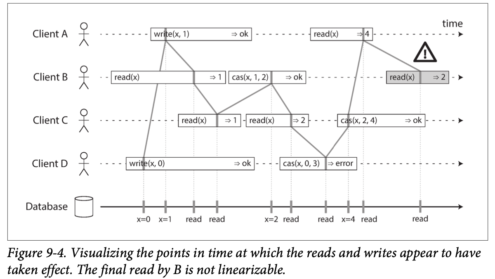

# Linearizability

Такая модель согласованности, при которой, несмотря на наличие копий данных, для пользователя системы создается эффект работы с единственным экземпляром.

> ... linearizability is a recency guarantee. [1]

Это с точки зрения человека естественное поведение при работе с единственной копией данных: вычитывается всегда самое актуальное значение. В отличие от [[Read your writes]] линеаризуемость обеспечивает *recency guarantee* и для разных клиентов.

Источник: [4]

В случае [[Causal cosistency]] *concurrent* операции не связаны **логическим** отношением *happens before*. А в случае линеаризуемости мы говорим про *real time order*, то есть даже если операции A и B не связаны логическим отношением, но A завершена до начала B, то исходя из *real time order* между ними существует строгий порядок: сначала А, потом В. Это касается не только при конкуренции записи и чтения, но и между чтениями: если одно чтение A закончилось раньше B, то B не может вернуть более раннюю версию, чем уже вернуло A.
Но если эти операции пересекаются по времени, то тут линеаризуемость допускает некоторую недетерминированность: неизвестно где именно в рамках прямоугольника времени выполнения окажется *точка линеаризуемости* 👇.

> Linearizable history can be expressed as a sequence of instantaneous operations that preserves the original operation order. [2]

Источник: [1]

Несмотря на то, что между полуением запроса и возвратом ответа проходит время, в случае линеаризуемости считается, что где-то в рамках этого промежутка существует момент (*linearizability point*), в который **атомарно** выполняется операция. Этом может быть как запись, так и чтение.

## Области применения

### Распределенная блокировка и [[Leader election]]

Если не обеспечить линеаризуемость, то в какой-то момент:

- один процесс возьмет блокировку, другой проверит занята она и получит ответ "свободна". В итоге два процесса будут думать, что блокировка у них
- произойдет *split brain*

Часто для реализации блокировки или leader election используют готовые решения, такие как *Zookeeper* и  *etcd*.

### Ограничения

Например, ограничение уникальности логина пользователя. Это можно рассматривать как блокировку, которая берется на конкретном логине и второй процесс уже не сможет ее занять.
Другой пример - продажа билетов на концерт/самолет. А ограничение - каждое место может купить только один раз. Альтернативой линеаризуемости будет использвоать более слабые гарантии, но предусмотреть логику на случай, если одно и то же место купили разные пользователи.
Еще пример - баланс банковского счета не может быть отрицательным.

## Реализация

1. [[Single leader replication]] с синхронной репликацией может обеспечить линеаризуемость. Но опять же, использование *snapshot isolation* может нарушить линеаризуемость.
1. [[Leaderless replication]] с использованием [[Quorum]] обеспечивает линеаризуемость только при условии синхронного [[Quorum|read repair]].
1. [[Consensus]]. С помощью алгоритма консенсуса можно реализовать хранилище с гарантией линеаризуемости 👇.

> The clients interact with the replicated state machine via commands. These commands are given to the consensus module, which determines if it is possible to commit the command to the replicated state machine and, if possible, does so. The state machine must be deterministic, so that when commands are committed the state machines remain identical. A fault-tolerant database is an example of one such application. Once a command has been committed, the consensus protocol guarantees that eventually the command will be committed on every live state machine and they will be committed in order. This provides linearisable semantics from the client, defined as each command from the client appearing to execute instantaneously, exactly once, at some point between its invocation and positive response. [3]

## Linearizability and CPU

> 💡 Even CPUs do not offer linearizability when accessing main memory by default. [2]

Это обусловлено тем, что каждое ядро CPU имеет свой кэш и может брать данные оттуда, а не из *main memory*. Соответственно имеем ситуацию с несколькими копиями данных. В .NET для решения этой проблемы используется ключевое слово [[Синхронизация|volatile]]

---

## Источники

1. [[Designing Data-Intensive Applications book]]. Chapter 9.
1. [[Database Internals book]]. Replication and consistency.
1. [ARC: Analysis of Raft Consensus. Heidi Howard](https://www.cl.cam.ac.uk/techreports/UCAM-CL-TR-857.pdf)
1. [Distributed Systems lecture series. 7.2. Martin Kleppmann](https://youtu.be/noUNH3jDLC0?si=RhwohabtNHe-NzJ6)

## Ссылки

1. [Distributed Systems 7.2: Linearizability. Martin Klepman](https://youtu.be/noUNH3jDLC0?si=_PCaU9wISRHN--xt)
