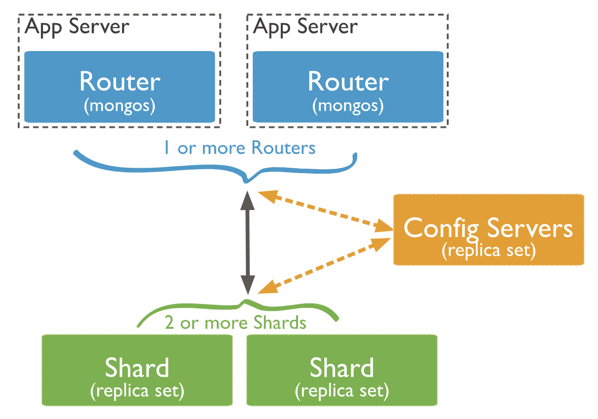

# MongoDB. Partitioning

Текущая версия 7.0

## Терминология

*shard, sharding*
*chunk* - набор документов, которые принадлежат шарду

## Стратегии партиционирования

[[Partition strategy]]

1. Hashed sharding
1. Range sharding

## Ребалансировка

Не нашел в документации описание ребалансировки, как ее описывает Клепман: перераспределение нагрузки между **нодами**. В документации есть описание фонового процесса Balancer, который отвечает за то, чтобы данные были равномерно распределены по **шардам**. Он запускается, когда разница между минимальным и максимальным объемом шардов становится в 3 раза больше лимита, который настраивается в конфигурации.

## Роутинг

[[Request routing]]

*Router* обращается к *Config Servers*, чтобы узнать к какому шарду нужно обратиться для выполнения запроса.

## Особенности

Возможно создавать шардированные и НЕшардированные коллекции в одной БД. Нешардированные коллекции по умолчанию располгаются в [Primary shard](https://www.mongodb.com/docs/manual/reference/glossary/#std-term-primary-shard).

---

## Источники

1. [MongoDb documentation](https://www.mongodb.com/docs/manual/sharding/)

## Ссылки

1. link
