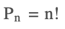
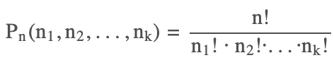
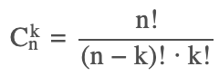
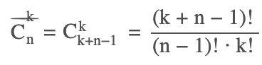
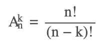
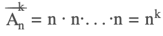

# Combinatorics

## Перестановки

### без повторений

Пусть имеется n **различных** объектов. Будем переставлять их всеми возможными способами (число и состав объектов остается неизменными, меняется только их **порядок**). Получившиеся комбинации называются *перестановками*.
На первую позицию есть выбор из n вариантов, на вторую - n-1 вариант, на третью - n-2 и так далее:



Пример 1: сколькими возможными способами можно составить список учеников из 6 человек?

### с повторениями

Пусть имеется n объектов различных типов:
    n1 объектов первого типа,
    n2 объектов второго типа,
    ...
    nk объектов k-го типа.
Сколькими способами можно переставить все объекты между собой?

ИЛИ

Пусть имеется n различных шаров и kящиков. Сколькими способами можно разложить шары по ящикам так, чтобы
    n1 шаров оказались в первом ящике,
    n2 шаров - во втором, ...,
    nk шаров - в k-ом ящике.

n=n1+n2+...+nk


Пример 1: сколько различных пятибуквенных слов можно создать из букв слова *манна*? Здесь имеем n = 5, n1 = 1 (буква М), n2 = 2 (A), n3 = 2 (H).
Пример 2: cколькими способами можно собрать гирлянду из 4 красных, 4 синих и 8 желтых флажков? n = 16, n1 = 4, n2 = 4, n3 = 8.
Пример 3: сколькими способами можно разбить группу 10 друзей на команды из 2 бандитов, 2 полицейских, 1 сыщика и 5 прохожих для игры?
Пример 3: есть двумерное поле ```n х m```. Как подсчитать какое кол-во возможных путей существует, если надо добраться от левой нижней точки до правой верхней? На пути от левой нижней к правой верхней нужно сделать n + m шагов. Возьмем как "основным" движение вверх(n шагов). Тогда из общего кооличества n + m шагов нужно будет выбрать m моментов, когда нужно будет сделать шаги вправо.



## Сочетания 

### без повторений

Формула сочетаний k из n является частным случаем формулы перестанок с повторениями, когда перестановки создаются только из двух типов n1 и n2. В этом случае n1 = k, n2 = n - k. Можно представить, что у нас есть n шаров и k ячеек, в которые может вместиться только один шар. Нужно найти сколько существет различных вариантов заполнить эти ячейки. При этом важен только набор шаров в ячейках, но не их порядок(поэтому в знаменателе k!), аналогично не важен порядок оставшейся части шаров - в знаменателе (n - k)!.

Пусть имеется n различных объектов и требуется найти число сочетаний из n объектов по k. Будем выбирать комбинации из k объектов всеми возможными способами, при этом будем обращать внимание на разный **состав** комбинаций, но не **порядок** (он тут не важен, в отличие от *размещений*).

Пример 1: какое количество пятерок можно составить в баскетбольной команде из 20 человек?



### с повторениями

Размещения с повторениями описывают количество спообов разложить kразличных шаров по n различным ящиков. А сколько получится способов, если шары одинаковые (в ящике может быть любое число шаров)?

Поступим следующим образом. Обозначим шары нулями, их будет k, а также введем n−1 единиц, которые будут обозначать "перегородки". Тогда любая последовательность из k нулей и n−1 единиц однозначно зафиксирует способ разложения шаров: число нулей до первой единицы - это число шаров в первом ящике, число нулей между первой и второй единицей - это число шаров во втором ящике и так далее.
А расставить k единиц в последовательности из k+n−1 объектов можно - это число сочетаний без повторений:



## Размещения

### без повторений

Пусть имеется n **различных** объектов. Будем выбирать из них k объектов и переставлять всеми возможными способами между собой (то есть меняется и **состав** выбранных объектов, и их **порядок**). Получившиеся комбинации называются *размещениями из n объектов по k*.



*Размещения* отличаются от *сочетаний* тем, что порядок имеет значение. Значит количество *размещений* можно получить из количества *сочетаний*, умноженного на количество вариантов, которое дает изменение порядка. Последнее в свою очередь соответствует числу *перестановок* k.


### с повторениями

Пусть имеется k **различных** шаров, и их нужно разложить по n **различным** ящикам (на число шаров в ящиках ограничений нет - ящик может вместить как все шары, так и остаться пустым).

Пример 1: в лифт 8-этажного дома вошли 4 пассажира. Сколькими способами они могут выйти (выход возможен на любом этаже, начиная со второго).
Пример 2: какое количество состояний можно закодировать 8-значным двоичным/десятичным числом?



---

## Источники

1. [МатБюро](https://www.matburo.ru/tv_calc.php)

## Ссылки

1. link
